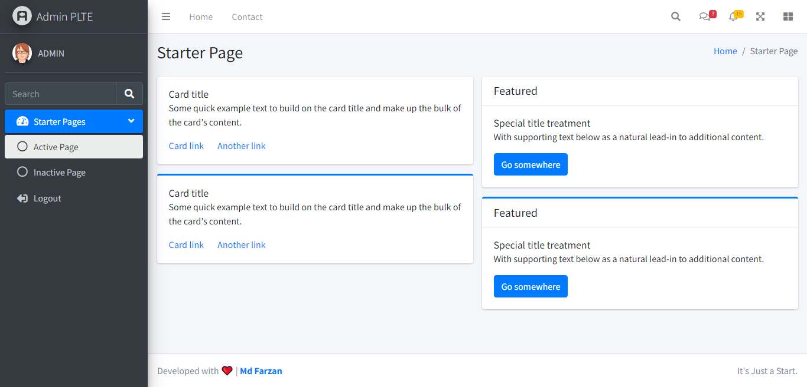

# Admin PLTE

Single user admin panel based on AdminLTE Dashboard and built using core php and mysql.

## Features
* Secure Authentication and Logout
* Password recovery with email
* Separate app config
* Single Admin
* Based on Admin LTE Dashboard
* Minimal design (admin forms, ex. sign-in form) for personal customization

## Built for
It's mainly built for academics projects. So the student can start their project without any authentication hassle.

## Deployment
1. import db_backup.zip mysql database given in *DEPLOYMENT* directory.
2. Sign in using credentials given in __credentials.txt__ into *DEPLOYMENT* directory.
3. All done, now start development 💻.

## License
[MIT License]('LICENSE.md')